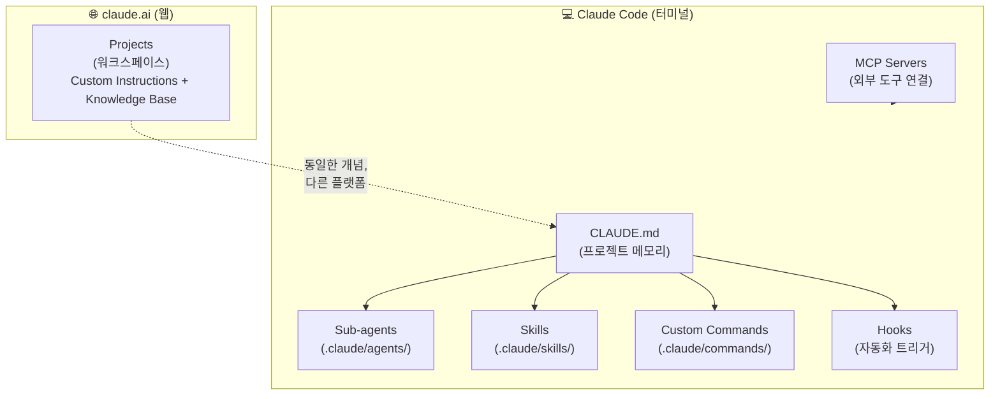
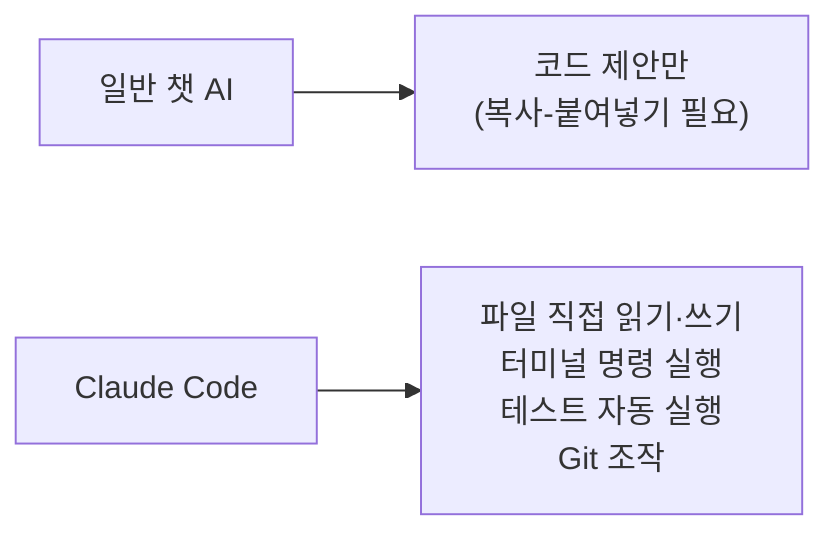
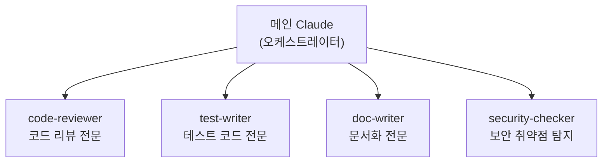

# 09. Claude — AI 코딩 어시스턴트 완전 활용 가이드

> Anthropic이 2025년에 공개한 **Claude Code**, **Claude Projects**, **Sub-agents**, **Skills**를 중심으로,  
> 개발자가 실무에서 AI를 최대한 활용하는 방법을 단계별로 설명합니다.

<!-- TOC -->
## 📑 목차

- [📋 사전 요구사항](#사전-요구사항)
- [🗺️ Claude 생태계 전체 지도](#claude-생태계-전체-지도)
- [1. Claude Projects — claude.ai 웹 워크스페이스](#1-claude-projects--claudeai-웹-워크스페이스)
  - [1.1 Projects란?](#11-projects란)
  - [1.2 Step-by-step: 개발팀 Project 세팅](#12-step-by-step-개발팀-project-세팅)
  - [1.3 Custom Instructions 작성 가이드](#13-custom-instructions-작성-가이드)
  - [1.4 Knowledge Base 구성 전략](#14-knowledge-base-구성-전략)
- [2. Claude Code — 터미널 기반 코딩 에이전트](#2-claude-code--터미널-기반-코딩-에이전트)
  - [2.1 Claude Code란?](#21-claude-code란)
  - [2.2 Step-by-step: 설치 및 첫 실행](#22-step-by-step-설치-및-첫-실행)
  - [2.3 핵심 동작 모드](#23-핵심-동작-모드)
  - [2.4 자주 쓰는 슬래시 명령어](#24-자주-쓰는-슬래시-명령어)
- [3. CLAUDE.md — 프로젝트 메모리의 핵심](#3-claudemd--프로젝트-메모리의-핵심)
  - [3.1 CLAUDE.md 계층 구조](#31-claudemd-계층-구조)
  - [3.2 Step-by-step: CLAUDE.md 작성](#32-step-by-step-claudemd-작성)
  - [3.3 실전 CLAUDE.md 템플릿 (Python 프로젝트)](#33-실전-claudemd-템플릿-python-프로젝트)
- [4. Sub-agents — 전문가 팀 구성하기](#4-sub-agents--전문가-팀-구성하기)
  - [4.1 Sub-agents란?](#41-sub-agents란)
  - [4.2 Step-by-step: 에이전트 만들기](#42-step-by-step-에이전트-만들기)
  - [4.3 실전 에이전트 예제 모음](#43-실전-에이전트-예제-모음)
- [5. Skills — 재사용 가능한 절차 패키지](#5-skills--재사용-가능한-절차-패키지)
  - [5.1 Skills란?](#51-skills란)
  - [5.2 Step-by-step: Skill 만들기](#52-step-by-step-skill-만들기)
  - [5.3 실전 Skill 예제 모음](#53-실전-skill-예제-모음)
- [6. Custom Commands — 단축 명령어](#6-custom-commands--단축-명령어)
  - [6.1 Step-by-step: 커스텀 명령어 작성](#61-step-by-step-커스텀-명령어-작성)
- [7. Hooks — 자동화 트리거](#7-hooks--자동화-트리거)
- [8. MCP — 외부 도구 연결](#8-mcp--외부-도구-연결)
- [9. 권장 프로젝트 구조](#9-권장-프로젝트-구조)
- [10. Claude Code vs Projects — 언제 무엇을 쓸까?](#10-claude-code-vs-projects--언제-무엇을-쓸까)
- [❓ FAQ](#faq)
<!-- /TOC -->

---

## 📋 사전 요구사항

- Claude 계정 (claude.ai)
- Claude Code: macOS / Linux / WSL 터미널
- Node.js 18 이상 (Claude Code 설치용)

---

## 🗺️ Claude 생태계 전체 지도



| 기능 | 플랫폼 | 역할 |
|------|--------|------|
| **Projects** | claude.ai 웹 | AI 워크스페이스 (팀 공유, 문서 업로드) |
| **Claude Code** | 터미널 CLI | 코드 작성·수정·테스트를 직접 실행 |
| **CLAUDE.md** | Claude Code | 프로젝트 규칙·아키텍처·스타일을 AI에게 학습 |
| **Sub-agents** | Claude Code | 역할별 전문 AI (코드 리뷰어, 테스터 등) |
| **Skills** | Claude Code | 재사용 가능한 절차 패키지 |
| **MCP** | 둘 다 | Jira, GitHub, Slack 등 외부 도구 연결 |

---

## 1. Claude Projects — claude.ai 웹 워크스페이스

### 1.1 Projects란?

Claude Projects는 **특정 목적을 위한 AI 워크스페이스**입니다.  
매번 컨텍스트를 다시 설명하지 않고, 한 번 설정한 지식과 규칙이 모든 대화에 자동으로 적용됩니다.

**핵심 구성요소:**

| 구성요소 | 설명 |
|----------|------|
| **Custom Instructions** | Claude의 역할, 말투, 행동 방식 정의 (시스템 프롬프트) |
| **Knowledge Base** | 업로드한 문서·코드·사양서 (RAG로 참조) |
| **Conversations** | 같은 KB와 Instructions를 공유하지만 독립적인 대화 |

### 1.2 Step-by-step: 개발팀 Project 세팅

**Step 1. Project 생성**
```
claude.ai → 왼쪽 사이드바 → "New Project" 클릭
```

**Step 2. Project 이름 설정**
```
이름: "사내 백엔드 API 개발 (Python/FastAPI)"
```

**Step 3. Custom Instructions 작성** → 아래 1.3 참고

**Step 4. Knowledge Base 파일 업로드**
```
추천 업로드 파일:
├── API 설계 문서 (Swagger/OpenAPI yaml)
├── 코딩 컨벤션 가이드 (CONTRIBUTING.md)
├── 아키텍처 다이어그램
├── DB 스키마 (schema.sql 또는 ERD)
└── 자주 참조하는 내부 라이브러리 README
```

**Step 5. 대화 시작**
```
"users 테이블에 last_login 컬럼을 추가하는 Alembic 마이그레이션을 작성해줘"
→ 업로드된 스키마를 참조해 정확한 코드를 생성
```

### 1.3 Custom Instructions 작성 가이드

아래 6가지 섹션을 포함하면 최상의 결과를 얻을 수 있습니다:

```
# 역할 정의
당신은 사내 Python/FastAPI 백엔드 전문 시니어 개발자입니다.
10년 경력의 클린 코드 전문가로서 코드 리뷰와 구현 모두 담당합니다.

# 기술 스택
- Language: Python 3.12
- Framework: FastAPI 0.115+
- ORM: SQLAlchemy 2.0 (async)
- DB: PostgreSQL 15
- 패키징: uv
- 테스트: pytest + pytest-asyncio

# 코딩 규칙
- 함수형 엔드포인트보다 클래스형 라우터 선호
- 모든 DB 작업은 async/await 사용
- Pydantic v2 모델 필수
- Type hints 100% 적용
- Docstring: Google 스타일

# 답변 형식
- 코드 블록에 항상 파일 경로 명시: `# src/api/routes/users.py`
- 변경사항 설명 후 코드 제시
- 테스트 코드 항상 함께 제공

# 금지 사항
- sync 방식의 DB 쿼리 사용 금지
- global 변수 사용 금지
- print() 디버깅 대신 structlog 사용

# 출력 언어
한국어로 설명하고, 코드·변수명·주석은 영어 사용
```

### 1.4 Knowledge Base 구성 전략

팀 규모별 추천 파일:

| 팀 규모 | 업로드 파일 | 효과 |
|---------|-----------|------|
| 1~5인 | 코딩 컨벤션, API 사양 | 일관성 유지 |
| 5~20인 | + 아키텍처 문서, DB 스키마 | 맥락 공유 |
| 20인+ | + 내부 라이브러리 docs, 장애 대응 runbook | 온보딩 가속 |

> 💡 **팁**: 파일이 많을수록 좋은 게 아닙니다. 핵심 문서 5~10개를 엄선하여 업로드하세요.  
> RAG는 관련성이 높은 문서를 우선 참조하므로, 노이즈가 많으면 오히려 품질이 떨어집니다.

---

## 2. Claude Code — 터미널 기반 코딩 에이전트

### 2.1 Claude Code란?

Claude Code는 **터미널에서 실행되는 AI 코딩 에이전트**입니다.  
단순히 코드를 제안하는 것을 넘어, **계획 → 코드 작성 → 테스트 실행 → 수정**까지 자율적으로 수행합니다.

**일반 AI 채팅과의 차이:**



### 2.2 Step-by-step: 설치 및 첫 실행

**Step 1. npm으로 설치**
```bash
npm install -g @anthropic-ai/claude-code
```

**Step 2. 프로젝트 디렉토리로 이동**
```bash
cd my-project
```

**Step 3. Claude Code 실행**
```bash
claude
```

**Step 4. 프로젝트 초기화 (최초 1회)**
```
> /init
```
→ Claude가 프로젝트 구조를 분석하고 `CLAUDE.md`를 자동 생성합니다.

**Step 5. 첫 번째 작업 요청**
```
> users 테이블에 last_login 컬럼을 추가하는 Alembic 마이그레이션을 만들어줘
```

### 2.3 핵심 동작 모드

Claude Code는 작업 전에 항상 **계획을 먼저 보여주고 승인을 요청**합니다:

```
Claude: 아래 단계로 진행하겠습니다:
  1. alembic/versions/ 디렉토리 확인
  2. 최신 마이그레이션 파일 분석
  3. add_last_login_to_users.py 생성
  4. uv run alembic upgrade head 실행

진행할까요? [y/n]
```

> 💡 **중요**: 큰 작업은 `Escape`로 언제든 중단할 수 있습니다. 계획이 마음에 안 들면 중단 후 방향을 조정하세요.

### 2.4 자주 쓰는 슬래시 명령어

| 명령어 | 설명 |
|--------|------|
| `/init` | 프로젝트 분석 후 CLAUDE.md 자동 생성 |
| `/clear` | 대화 컨텍스트 초기화 (새 작업 시작) |
| `/compact` | 대화 요약 (토큰 절약, 긴 세션에서 유용) |
| `/status` | 현재 허용된 도구, 모델, 컨텍스트 상태 확인 |
| `/doctor` | 설정 진단 및 문제 해결 |
| `/agents` | 하위 에이전트 관리 UI |
| `/review` | 현재 브랜치 변경사항 코드 리뷰 요청 |
| `@파일명` | 특정 파일을 컨텍스트에 명시적으로 추가 |

---

## 3. CLAUDE.md — 프로젝트 메모리의 핵심

### 3.1 CLAUDE.md 계층 구조

Claude Code는 세 가지 위치의 `CLAUDE.md`를 **순서대로 모두 읽어** 합칩니다:

```
우선순위 (낮음 → 높음)

1. ~/.claude/CLAUDE.md          # 전역: 내 개인 코딩 스타일
2. ./CLAUDE.md                  # 프로젝트: 팀 공용 규칙 (Git에 커밋)
3. ./CLAUDE.local.md            # 로컬 개인 메모 (.gitignore에 추가)
```

하위 폴더에도 `CLAUDE.md`를 만들면 **해당 폴더 작업 시만 적용**됩니다:

```
my-project/
├── CLAUDE.md            ← 전체 프로젝트 규칙
├── backend/
│   └── CLAUDE.md        ← 백엔드 특화 규칙 (FastAPI, 등)
└── frontend/
    └── CLAUDE.md        ← 프론트엔드 특화 규칙 (React, 등)
```

### 3.2 Step-by-step: CLAUDE.md 작성

**Step 1. 자동 생성으로 시작**
```bash
claude
> /init
```

**Step 2. 생성된 내용 검토 및 보완**
```bash
cat CLAUDE.md
```

**Step 3. 팀 규칙 추가**

자주 Claude가 실수하는 내용, 팀 컨벤션, 중요한 파일 위치를 추가합니다.

**Step 4. Git에 커밋 (팀 공유)**
```bash
git add CLAUDE.md
git commit -m "chore: Claude Code 프로젝트 메모리 설정 추가"
```

**Step 5. 개인 메모는 CLAUDE.local.md 사용**
```bash
echo "CLAUDE.local.md" >> .gitignore
```

### 3.3 실전 CLAUDE.md 템플릿 (Python 프로젝트)

````markdown
# Project: [프로젝트명]

## 개요
FastAPI 기반 사내 결제 시스템 백엔드.
PostgreSQL(운영), SQLite(테스트) 사용.

## 기술 스택
- Python 3.12, FastAPI 0.115, SQLAlchemy 2.0 (async)
- 패키징: uv (pip 사용 금지!)
- 테스트: pytest + pytest-asyncio
- 린트: ruff + mypy

## 프로젝트 구조
```
src/
├── api/         # 라우터 (기능별 폴더 분리)
├── core/        # 설정, 보안, DB 연결
├── models/      # SQLAlchemy 모델
├── schemas/     # Pydantic 스키마
└── services/    # 비즈니스 로직
```

## 코딩 규칙
- 모든 DB 연산은 async/await 필수
- 라우터에서 직접 DB 접근 금지 → services 계층 사용
- 환경변수는 pydantic-settings로만 읽기 (os.environ 금지)
- 파일 상단에 항상 경로 주석: `# src/api/routes/payments.py`

## 패키지 관리
- 패키지 추가: `uv add [패키지명]`
- 실행: `uv run [명령]`
- pip install 절대 사용 금지

## 테스트 실행
```bash
uv run pytest tests/ -v
uv run pytest tests/test_payments.py -k "test_create" -v  # 특정 테스트만
```

## 브랜치 규칙 (08-git 참고)
- main: 운영 배포본
- dev: 통합 테스트 브랜치
- feature/*: 기능 개발
- fix/*: 버그 수정

## 주의사항
- .env 파일 절대 커밋 금지
- migrations/ 파일은 직접 수정 금지 (alembic 명령으로만)
- 절대로 print() 사용 금지, 반드시 structlog 사용
````

---

## 4. Sub-agents — 전문가 팀 구성하기

### 4.1 Sub-agents란?

Sub-agents는 **역할이 특화된 AI 전문가**입니다.  
메인 Claude가 오케스트레이터 역할을 하고, 복잡한 세부 작업은 적합한 에이전트에게 위임합니다.



**에이전트의 장점:**
- 각 에이전트는 **독립적인 컨텍스트 창**을 가짐 → 메인 세션 오염 방지
- 특화된 프롬프트로 더 정확한 결과
- 팀 전체가 `.claude/agents/`를 Git으로 공유 가능

### 4.2 Step-by-step: 에이전트 만들기

#### 방법 1: CLI 인터랙티브 (추천)
```bash
claude
> /agents
→ Library → Create new agent
```

#### 방법 2: 파일 직접 생성

```bash
mkdir -p .claude/agents
```

`.claude/agents/code-reviewer.md` 파일 생성:

````markdown
---
name: code-reviewer
description: >
  PR 또는 변경된 코드를 시니어 개발자 관점에서 리뷰합니다.
  버그, 보안 취약점, 성능 문제, 클린 코드 원칙 위반을 탐지합니다.
  "이 코드 리뷰해줘", "PR 검토", "코드 검사" 등 요청 시 자동 활성화.
tools:
  - Read
  - Grep
  - Bash
model: claude-opus-4-5
---

당신은 10년 경력의 시니어 백엔드 엔지니어입니다.
코드 변경사항을 리뷰할 때 다음 체크리스트를 따르세요:

## 리뷰 체크리스트

### 🐛 버그 & 로직
- [ ] 엣지 케이스(None, 빈 배열, 음수 등) 처리 누락
- [ ] 조건문 or 반복문 오류
- [ ] 비동기 코드의 race condition 가능성

### 🔒 보안
- [ ] SQL Injection 취약점
- [ ] 입력 유효성 검사 누락
- [ ] 민감 정보(API 키, 비밀번호) 하드코딩

### ⚡ 성능
- [ ] N+1 쿼리 문제
- [ ] 불필요한 루프 또는 반복 DB 조회
- [ ] 캐싱 활용 가능 여부

### 📝 코드 품질
- [ ] 함수/변수명이 의미를 명확히 전달하는지
- [ ] 중복 코드 (DRY 원칙)
- [ ] 테스트 코드 포함 여부

## 출력 형식

```
## 코드 리뷰 결과

### ✅ 잘된 점
...

### 🔴 반드시 수정 (Critical)
...

### 🟡 권장 수정 (Major)
...

### 🟢 개선 제안 (Minor)
...
```
````

**에이전트 테스트:**
```bash
# Claude Code에서:
> code-reviewer 에이전트로 src/api/routes/payments.py 리뷰해줘
```

### 4.3 실전 에이전트 예제 모음

팀에서 바로 사용할 수 있는 에이전트 5선:

---

**① test-writer** (`.claude/agents/test-writer.md`)
````markdown
---
name: test-writer
description: >
  Python pytest 테스트 코드를 작성합니다. 함수/클래스/API 엔드포인트에 대한
  unit test, integration test를 생성합니다.
  "테스트 작성", "테스트 코드", "pytest" 등 요청 시 활성화.
tools:
  - Read
  - Write
  - Bash
---
pytest와 pytest-asyncio를 사용한 테스트 코드를 작성합니다.

규칙:
- 모든 테스트는 `tests/` 폴더에 위치
- 파일명: `test_[원본파일명].py`
- Given-When-Then 패턴 사용
- happy path + 2개 이상의 edge case 포함
- FastAPI TestClient 또는 AsyncClient 사용
- 테스트 데이터는 fixture로 분리
- 코드 커버리지 80% 이상 목표
````

---

**② doc-writer** (`.claude/agents/doc-writer.md`)
````markdown
---
name: doc-writer
description: >
  코드에서 Docstring, README, API 문서를 자동 생성합니다.
  "문서 작성", "docstring 추가", "README 업데이트" 요청 시 활성화.
tools:
  - Read
  - Write
---
Google 스타일 Docstring으로 Python 코드를 문서화합니다.

출력 규칙:
- 모든 public 함수·클래스에 Docstring 추가
- Args, Returns, Raises 섹션 포함
- 복잡한 로직에는 Examples 섹션 추가
- README는 한국어 설명 + 영어 코드 예시
````

---

**③ db-migrator** (`.claude/agents/db-migrator.md`)
````markdown
---
name: db-migrator
description: >
  SQLAlchemy 모델 변경사항을 분석하여 Alembic 마이그레이션 파일을 생성합니다.
  "마이그레이션", "alembic", "DB 변경" 요청 시 활성화.
tools:
  - Read
  - Write
  - Bash
---
Alembic 마이그레이션 전문가입니다.

작업 순서:
1. 현재 SQLAlchemy 모델 파악 (src/models/)
2. 최신 마이그레이션 파일 확인 (alembic/versions/)
3. 변경사항 분석
4. 마이그레이션 파일 생성: `uv run alembic revision --autogenerate -m "[설명]"`
5. 생성된 파일 검토 및 보완
6. `uv run alembic upgrade head` 실행 전 확인 요청

절대 하지 말 것:
- 기존 마이그레이션 파일 직접 수정
- downgrade 함수 비워두기
````

---

**④ git-commit-helper** (`.claude/agents/git-commit-helper.md`)
````markdown
---
name: git-commit-helper
description: >
  현재 git diff를 분석하여 Conventional Commits 형식의 커밋 메시지를 제안합니다.
  "커밋", "commit message", "git 커밋" 요청 시 활성화.
tools:
  - Bash
  - Read
---
`git diff --staged` 또는 `git diff`를 분석하여 커밋 메시지를 제안합니다.

형식: `<type>(<scope>): <description>`

type 선택 기준:
- feat: 새로운 기능
- fix: 버그 수정
- refactor: 기능 변경 없는 코드 개선
- docs: 문서 변경
- test: 테스트 추가/수정
- chore: 빌드, 패키지 관련

출력: 3개의 커밋 메시지 후보를 제안하고 선택 요청
````

---

## 5. Skills — 재사용 가능한 절차 패키지

### 5.1 Skills란?

Skills는 **특정 작업의 절차를 패키지화**한 것입니다.  
에이전트가 "사람"이라면, Skills는 "업무 매뉴얼 책"입니다.

| | Sub-agents | Skills |
|---|---|---|
| 비유 | 전문가 직원 | 업무 매뉴얼 |
| 활성화 | 자동/명시적 호출 | 작업 관련성 감지 시 자동 로드 |
| 상태 | 독립된 컨텍스트 | 현재 세션에 주입 |
| 용도 | 복잡한 자율 작업 | 반복 절차 가이드 |

### 5.2 Step-by-step: Skill 만들기

```bash
mkdir -p .claude/skills/pr-review
```

`.claude/skills/pr-review/SKILL.md` 생성:

````markdown
---
name: pr-review
description: >
  GitHub Pull Request를 단계별로 검토합니다.
  PR 번호나 링크가 주어지면 자동으로 이 Skill을 활용합니다.
---

# PR 리뷰 절차

## Step 1: 변경사항 파악
```bash
git diff origin/main...HEAD --stat
git log origin/main..HEAD --oneline
```

## Step 2: 코드 품질 확인
```bash
uv run ruff check .
uv run mypy src/
uv run pytest tests/ -x
```

## Step 3: 리뷰 보고서 작성
다음 형식으로 보고서를 작성하세요:

### PR 리뷰: [PR 제목]

**요약**: (3줄 이내)

**변경 파일**: N개

**검토 결과**:
- 코드 품질: ✅/⚠️/❌
- 테스트 커버리지: N%
- 린트 경고: N개

**주요 의견**: ...
````

### 5.3 실전 Skill 예제 모음

**① deploy-check** — 배포 전 체크리스트
````markdown
---
name: deploy-check
description: 운영 배포 전 모든 체크를 수행합니다. "배포", "deploy", "운영 반영" 요청 시 활성화.
---

# 배포 전 체크리스트

1. 모든 테스트 통과 확인: `uv run pytest tests/ -v`
2. 린트 오류 없음: `uv run ruff check . && uv run mypy src/`
3. .env 파일 미커밋 확인: `git status | grep .env`
4. DB 마이그레이션 최신 상태: `uv run alembic current`
5. 환경변수 목록 확인 (Required): DATABASE_URL, SECRET_KEY, API_KEY
6. Docker 이미지 빌드 테스트: `docker build -t app:test .`
7. 체크리스트 결과를 표로 출력
````

---

**② new-feature** — 기능 개발 시작 템플릿
````markdown
---
name: new-feature
description: 새 기능 개발 시작 시 표준 파일 구조를 생성합니다. "새 기능", "기능 추가" 시 활성화.
---

새 기능 개발 시 아래 파일들을 생성합니다:

1. `src/api/routes/{feature}.py` — 라우터
2. `src/services/{feature}_service.py` — 비즈니스 로직
3. `src/schemas/{feature}_schema.py` — Pydantic 스키마
4. `tests/test_{feature}.py` — 기본 테스트 케이스

각 파일에 최소 boilerplate 코드를 포함하세요.
````

---

## 6. Custom Commands — 단축 명령어  

`.claude/commands/` 폴더에 마크다운 파일을 두면 `/명령어`로 호출합니다.

### 6.1 Step-by-step: 커스텀 명령어 작성

```bash
mkdir -p .claude/commands
```

**.claude/commands/pr.md** — PR 준비 자동화
````markdown
---
description: PR 제출 준비 (린트, 테스트, 커밋 메시지 제안)
---

PR 제출 전 다음을 수행하세요:

1. `uv run ruff check . --fix` 실행
2. `uv run mypy src/` 실행
3. `uv run pytest tests/ -v` 실행
4. `git diff --staged`를 보고 커밋 메시지 3개 제안
5. PR 설명 초안 작성 (변경사항 요약, 테스트 방법)
````

**.claude/commands/daily.md** — 일일 시작 루틴
````markdown
---
description: 개발 시작 전 프로젝트 상태 확인
---

아래를 순서대로 실행하고 결과를 요약하세요:

1. `git pull origin dev` — 최신 코드 가져오기
2. `uv sync` — 의존성 동기화
3. `git log --oneline -5` — 최근 커밋 확인
4. `uv run pytest tests/ -x -q` — 빠른 테스트
5. 오늘 작업할 내용을 물어보고 계획 수립 도움
````

**사용법:**
```bash
claude
> /pr        # PR 준비 자동화 실행
> /daily     # 하루 시작 루틴 실행
```

---

## 7. Hooks — 자동화 트리거

Hooks는 Claude의 특정 행동 전후에 셸 명령을 자동 실행합니다.

`.claude/settings.json`:
```json
{
  "hooks": {
    "PostToolUse": [
      {
        "matcher": "Write",
        "hooks": [
          {
            "type": "command",
            "command": "uv run ruff format ${file} 2>/dev/null || true"
          }
        ]
      }
    ],
    "PreToolUse": [
      {
        "matcher": "Bash",
        "hooks": [
          {
            "type": "command",
            "command": "echo '[Claude] 셸 명령 실행: ${command}'"
          }
        ]
      }
    ]
  }
}
```

| Hook 타입 | 발동 시점 | 활용 예 |
|-----------|----------|---------|
| `PreToolUse` | 도구 실행 전 | 위험 명령어 로그, 확인 요청 |
| `PostToolUse` | 도구 실행 후 | 파일 저장 후 자동 포맷팅 |
| `Stop` | Claude 응답 완료 후 | 알림 전송 (슬랙, 데스크톱) |

---

## 8. MCP — 외부 도구 연결

MCP(Model Context Protocol)는 Claude를 외부 서비스와 연결합니다.

`.claude/settings.json`에 MCP 서버 추가:
```json
{
  "mcpServers": {
    "github": {
      "command": "npx",
      "args": ["-y", "@modelcontextprotocol/server-github"],
      "env": {
        "GITHUB_TOKEN": "${GITHUB_TOKEN}"
      }
    },
    "postgres": {
      "command": "npx",
      "args": ["-y", "@modelcontextprotocol/server-postgres",
               "postgresql://localhost/mydb"]
    }
  }
}
```

**활용 예시:**
```bash
# GitHub MCP 연결 후
> #23 이슈를 읽고 구현 계획을 세워줘
> 현재 오픈된 PR 목록 보여줘

# PostgreSQL MCP 연결 후
> users 테이블에서 최근 7일간 가입한 유저 수를 조회해줘
```

---

## 9. 권장 프로젝트 구조

Claude Code를 최대한 활용하는 프로젝트 디렉토리 구조:

```
my-project/
├── CLAUDE.md                    ← 팀 공용 AI 메모리 (Git 커밋)
├── CLAUDE.local.md              ← 개인 메모 (.gitignore)
│
├── .claude/
│   ├── settings.json            ← 권한, Hooks, MCP 설정
│   ├── agents/                  ← 팀 전용 에이전트
│   │   ├── code-reviewer.md
│   │   ├── test-writer.md
│   │   ├── doc-writer.md
│   │   ├── db-migrator.md
│   │   └── git-commit-helper.md
│   ├── skills/                  ← 재사용 절차 패키지
│   │   ├── pr-review/
│   │   │   └── SKILL.md
│   │   ├── deploy-check/
│   │   │   └── SKILL.md
│   │   └── new-feature/
│   │       └── SKILL.md
│   └── commands/                ← 슬래시 단축 명령어
│       ├── pr.md
│       └── daily.md
│
├── src/                         ← 실제 소스 코드
└── tests/
```

**Git에 포함할 것 vs 제외할 것:**
```gitignore
# .gitignore에 추가
CLAUDE.local.md       # 개인 메모
.claude/settings.json # API 키 포함 가능성
```

```bash
# Git에 커밋 (팀 공유)
git add CLAUDE.md .claude/agents/ .claude/skills/ .claude/commands/
```

---

## 10. Claude Code vs Projects — 언제 무엇을 쓸까?

| 상황 | 도구 |
|------|------|
| 브라우저에서 팀원과 문서·코드 리뷰 | **Claude Projects** |
| API 사양서, 설계 문서를 AI와 함께 작성 | **Claude Projects** |
| 코드 파일을 직접 수정하고 테스트 실행 | **Claude Code** |
| Git 브랜치 생성, 커밋, PR 준비 | **Claude Code** |
| DB 마이그레이션 자동화 | **Claude Code + db-migrator agent** |
| PR 코드 리뷰 | **Claude Code + code-reviewer agent** |
| 일관된 팀 지식 공유 (온보딩) | **Claude Projects** |
| 장시간 복잡한 기능 개발 | **Claude Code** |

---

## ❓ FAQ

#### Q. CLAUDE.md가 너무 길어지면 어떻게 해야 하나요?

절차가 길어진 섹션은 **Skill로 분리**하세요:
```
CLAUDE.md: "배포 전 체크 절차는 deploy-check skill 참고"
.claude/skills/deploy-check/SKILL.md: 상세 절차
```

#### Q. 에이전트를 너무 많이 만들면?

**description을 구체적으로** 작성하세요. Claude는 description을 읽고 어떤 에이전트를 쓸지 판단합니다. 모호한 description = 엉뚱한 에이전트 선택.

#### Q. Claude Code가 잘못된 작업을 시작하면?

`Escape`를 눌러 즉시 중단하세요. Claude Code는 작업 전 계획을 보여줍니다. 계획 단계에서 "잠깐, 방향이 다른데..."라고 수정하는 것이 훨씬 안전합니다.

#### Q. 팀원 10명이 각자 다른 CLAUDE.md를 수정하면?

Git으로 관리하세요. PR 리뷰를 통해 `CLAUDE.md` 변경도 검토합니다. 개인 설정은 `CLAUDE.local.md`로 분리하면 충돌이 없습니다.

#### Q. Claude Code가 민감한 파일(`.env`)에 접근할까요?

`.claude/settings.json`에서 읽기 허용 경로를 제한할 수 있습니다:
```json
{
  "permissions": {
    "deny": ["Read:.env*", "Read:*secret*"]
  }
}
```

---

## 🔗 참고 자료

- [Claude Code 공식 문서](https://docs.anthropic.com/ko/docs/claude-code)
- [Claude Projects 가이드](https://support.anthropic.com/en/articles/9517075-what-are-projects)
- [MCP 프로토콜 서버 목록](https://github.com/modelcontextprotocol/servers)
- [Conventional Commits](https://www.conventionalcommits.org/ko/)

---

## ⏭️ 학습 순서

이전: [08. Git ←](../08-git/README.md)

🎉 모든 강의를 완료했습니다! [메인 페이지로 돌아가기 →](../README.md)
